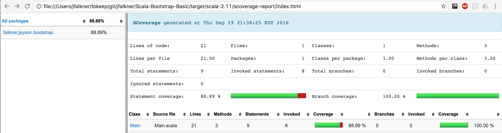
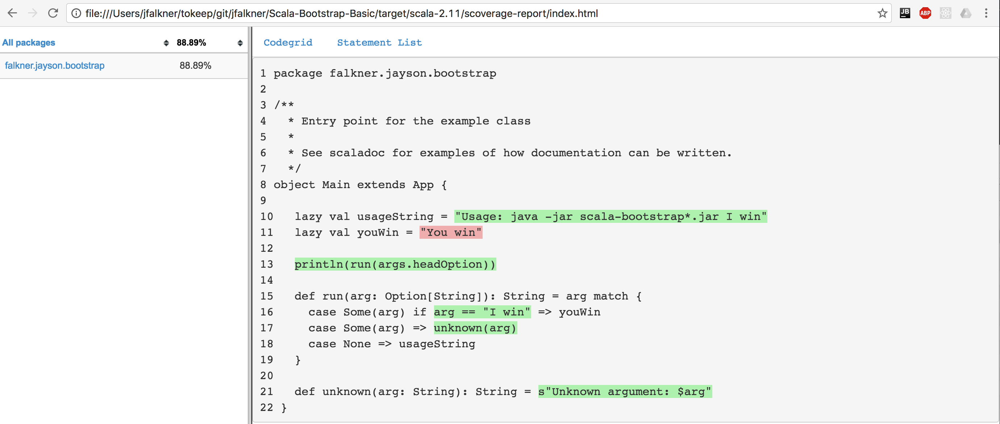

# Scala-Bootstrap

> WIP: Just put this up so that I can add notes as they come up. If interested, please wait for v1!

Working with Scala and still learning stuff? Bootstrap examples for a reasonable coding workflow and team dev process

- Build, test and run a scala project from scratch (in less than a minute!)
  - Local setup. Changing your computer's config.
  - VM via Vargrant, Virtualbox and Ansible. Won't change your computer's config.
- [Basic edit, test, code coverage and pack cycle](https://github.com/jfalkner/Scala-Bootstrap/blob/master/README.md#basic-edit-test-code-coverage-and-pack-cycle)
  - Build via `sbt clean run`
  - Test and Coverage via `sbt coverage test coverageReport`
  - Deploy via `sbt clean coverageOff pack`
- Improvements
  - Continuous Integration (CI)
  - Peer-review via GitHub PRs
  - [CHANGELOG.md based on `git tag -ln`](https://github.com/jfalkner/Scala-Bootstrap/blob/master/README.md#changelogmd-based-on-git-tag--ln)
  - [IntelliJ Scala IDE](#intellij-scala-ide)
  - Netbeans for JVM profiling (local and remote)

Stuff to add when time permits
- Base repo that has a build.sbt, expected structure, test, coverage and pack
- IntelliJ setup
- Dep on other SBT single projects (RootRef) and multi projects (ProjectRef)
- Bamboo CI config


## Basic edit, test, code coverage and pack cycle

Fork the [Scala Bootstrap Basic](https://github.com/jfalkner/Scala-Bootstrap-Basic) repository. It has everything setup for a basic testing, code coverage and pack/deploy cycle. You can use this repository as a starting point for any new scala project.

Tests and code coverage are the main items to facilitate code review. Run `sbt clean coverage test coverageReport` to kick off an example cycle.

```bash
$ sbt clean coverage test coverageReport

[info] Loading project definition from Scala-Bootstrap-Basic/project
[info] Set current project to Scala Bootstrap (in build file:Scala-Bootstrap-Basic/)
[success] Total time: 0 s, completed Sep 29, 2016 9:38:17 PM
[info] Set current project to Scala Bootstrap (in build file:Scala-Bootstrap-Basic/)
[info] Updating {file:Scala-Bootstrap-Basic/}scala-bootstrap-basic...
[info] Resolving jline#jline;2.12.1 ...
[info] Done updating.
[info] Compiling 1 Scala source to Scala-Bootstrap-Basic/target/scala-2.11/classes...
[info] [info] Cleaning datadir [Scala-Bootstrap-Basic/target/scala-2.11/scoverage-data]
[info] [info] Beginning coverage instrumentation
[info] [info] Instrumentation completed [9 statements]
[info] [info] Wrote instrumentation file [Scala-Bootstrap-Basic/target/scala-2.11/scoverage-data/scoverage.coverage.xml]
[info] [info] Will write measurement data to [Scala-Bootstrap-Basic/target/scala-2.11/scoverage-data]
[info] Compiling 2 Scala sources to Scala-Bootstrap-Basic/target/scala-2.11/test-classes...
[info] CommandLineSpec
[info]
[info] Command line usage should
[info] + stdout should mimic API
[info]
[info] Total for specification CommandLineSpec
[info] Finished in 10 ms
[info] 1 example, 0 failure, 0 error
[info] ApiSpec
[info]
[info] API should
[info] + Show usage if no arguments
[info] + Show usage if wrong argument
[info]
[info] Total for specification ApiSpec
[info] Finished in 1 ms
[info] 2 examples, 0 failure, 0 error
[info] Passed: Total 3, Failed 0, Errors 0, Passed 3
[success] Total time: 6 s, completed Sep 29, 2016 9:38:24 PM
[info] Waiting for measurement data to sync...
[info] Reading scoverage instrumentation [Scala-Bootstrap-Basic/target/scala-2.11/scoverage-data/scoverage.coverage.xml]
[info] Reading scoverage measurements...
[info] Generating scoverage reports...
[info] Written Cobertura report [Scala-Bootstrap-Basic/target/scala-2.11/coverage-report/cobertura.xml]
[info] Written XML coverage report [Scala-Bootstrap-Basic/target/scala-2.11/scoverage-report/scoverage.xml]
[info] Written HTML coverage report [Scala-Bootstrap-Basic/target/scala-2.11/scoverage-report/index.html]
[info] Statement coverage.: 88.89%
[info] Branch coverage....: 100.00%
[info] Coverage reports completed
[info] All done. Coverage was [88.89%]
[success] Total time: 1 s, completed Sep 29, 2016 9:38:25 PM
```

Next look at the `scoverage` code coverage report by opening `target/scala-2.11/scoverage-report/index.html` in a browser. It shows an overview of the code and what classes, methods and branches were used. In this case there are 21 lines of code and 88.89% of them are covered by tests.



This sort of report summary is good. 89% coverage is high and likely means the codebase is in good shape, especially since there is a low line count. Low coverage often means that some classes or methods are entirely untested. In this case, there is just one class and it has high coverage. If a class is entirely untested, assume it is abandoned code and try to delete it. If it must be kept, explain why in a test that covers it. The same logic applies to methods. You can see coverage of methods and branches by clicking on a class. 



In this case notice that not all of the lines are green. The val `You win` is never used and it appears that the match has three conditions but only two are tested. The third test of using an argumetn of "I win" is never checked. This is a contrived case, but assuming it should be kept a unit test should be added that asserts if "I win" is passed, "You win" is returned. If more pessimistic, you could assume no one should ever win and it'd be more appropriate to trim these lines from the codebase.

Coverage reports are nice. They let you confirm these expectations are met.

- Does the code have any sort of testing?
- What are the main use cases the code is expected to satisfy? Each should have at least one test explaining it, mocking up data and confirming that the code works.
- What code should be trimmed because it is not used?

If you skip out on any of the above, it'll likely mean more work later. Coverage reports and testing are a key part of the basic dev cycle.

### Try editing the code and repeating the above review

Assume the above was your code and you're optimistic and the "I win" case should be kept. Edit the `CommandLineSpec` to have a test showing that when the user types "I win" the code responds "You win".

```scala
    "I win should work" in {
      stdout {
        Main.main(Array[String]("I win"))
      }.trim mustEqual Main.youWin
    }
```

Re-run `sbt clean coverage test coverageReport` and re-visit the code coverage report. It'll now show 100% coverage.

In general, this is a good dev cycle to start with. Make your code and get it to the point where the code coverage report looks good. Then open a PR and reference the report. It not only asserts that the code works, but it both helps the rest of the team and yourself remember what the code was intended to do and how to use it.

### What else to learn from the basic setup

There are a few nice things you can edit or otherwise copy-paste from the basic setup. When possible, it is setup so you can just browse through the files and they are self-explanatory. 

- See `built.sbt` it has all the basic SBT project config for the test, coverage and pack cycle and other often used things such as project info, JVM options, maven hosted dependencies and depedencies in git repos.
- The directory structure of Scala Bootstrap Basic is made to work with SBT. It is convenient to have a blank copy of the expected conventions. e.g. `build.sbt`, where to put source files and where to put tests.
- Make tests and keep test-specific code out of `main/src`. Copy and paste the API and command-line based tests as needed to make your own. `CommandLineUtil` is also a helpful way to buffer stdout and stderr, if you expose a command-line interface. Similar helper traits are a good idea for whatever the main inputs and outputs you expect users to see.

## CHANGELOG.md based on `git tag -ln`

["Semantic Versioning"](http://semver.org/) of the code is helpful. Just use it. Amongst other benefits, it allows a 1-to-1 mapping of a logical identifier such a "0.0.1" to a git commit that represents a release of the code. Adopting this convention means you force developers to `git tag` specific meaningful commits and maintain `built.sbt`'s `version in ThisBuild := "0.0.1"` versioning. 

For example, if my codes semantic version is 1.2.3 then the codebase must have these things.

```
# build.sbt must have this string
version in ThisBuild := "1.2.3"

# after pushing the code related to 1.2.3 then the commit must be tagged and have the tag pushed
git tag -a 1.2.3 -m "My changelog message. The code was updated to do xzy..."
git push -u origin 1.2.3

# Other use of the code can now checkout this version
git clone repo_url
git checkout 1.2.3

# other Scala projects can import the tagged version as follows in build.sbt 
lazy val my_project = (project in file(".")).dependsOn(other_project)
lazy val other_project = RootProject(uri("http://github.com/jfalkner/scala-bootstrap.git#v1.2.3"))
```

All of the above is helpful since it makes it convenient to peg builds of the code or projects that use your code to a specific version. The `git tag` use also provides a convenient message for a changelog that displays these logical versions.

You can now auto-generate your `CHANGELOG.md` with this line.

```bash
git tag -ln | sort -r > CHANGELOG.md
```

You'll now have a CHANGELOG.md such as the following.

```
v1.2.3          Fixed broken tests by importing correct libraries.
v1.2.2          Patch to fix bug Z. See scala-boostrap#789
v1.2.1          Patch to fix bug Y. See scala-boostrap#456
v1.2.0          Refactored API to use new framework xyz. 50% faster performance.
v1.1.94          Patch to fix bug X. See scala-boostrap#123
...
```

Don't like the tag messages? Edit them via git and put pressure on whoever is making crappy log messages to improve them. You can use `git log 1.2.3` to see the full log message, author, time and commit hash. 


## Private Forks of Public Repos

If you must, here is a strategy to fork public repos so that you have a private version. For example, your company uses BitBucket and you are using a GitHub-hosted scala API (e.g. [jfalkner/file_monitor](https://github.com/jfalkner/file_monitor)).

The main benefits here are that you will have a private company copy that you can edit it directly. It is not common that public repos are deleted, and worse case you will have the compiled JAR with any previous release. Regardless, a full source-code copy may be desired. Keep in mind that it may be a bad idea to edit the code without contributing back to the main repo. It fragments the codebase and becomes more code that you must maintain.

```
# start with the GH repo
git clone https://github.com/jfalkner/file_monitor.git
cd file_monitor

# checkout the branch from your company's BB
git remote add bb http://git@bitbucket.mycompany.com:7990/scm/itg/mycompany_file_monitor.git
git fetch bb
git checkout -b mycompany_fork bb/mycompany_fork

# do any edits, commits and merges

# push back to BB then make a PR there
git push -u bb mycompany_fork
```

The convention above is to have a `mycompany_fork` branch as the main branch in your company's copy. You can they make all builds dependent on that and otherwise leave version numbers the same. If you end up altering the source-code, then you'll need to track your own version numbers. e.g. if `1.2.3` is the public repo's version, append another minor for your company's copy: `1.2.3.1`.

## IntelliJ Scala IDE

IntelliJ has a nice Scala IDE. I've used Netbeans for years and still prefer it for JVM profiling (it is free too); however, IntelliJ exposes fast code editing, formatting, code imports and most all of the common, powerful code refactoring tools. Arguably, an easy choice for efficiently working with an Scala codebase.

### Importing SBT Projects

It is trivial to import SBT projects. "New" -> "Project with existing sources..." then pick the directory with your project (for example [Scala-Bootstrap-Basic](https://github.com/jfalkner/Scala-Bootstrap-Basic/)). IntelliJ will auto-import and build everything based on `built.sbt`. Conventiently, this will include any dependencies (such as git repos) and load the source-code too.

TODO: Add some screenshots for Scala-Bootstrap-Basic.

### Increase JVM Memory + Concurrent GC

If IntelliJ seems slow or gets slow the more it is used, it is likely that the JVM needs to be tuned. Use ["Help" -> "Edit Custom VM Options" as per the docs](https://intellij-support.jetbrains.com/hc/en-us/articles/206544869-Configuring-JVM-options-and-platform-properties). Full list of VM options are in [Oracle's Hotspot VM docs](http://www.oracle.com/technetwork/articles/java/vmoptions-jsp-140102.html). This [blog of a dev making similar tweaks](http://www.dggodfrey.com/blog/2014/11/06/fix-slow-intellij-idea/) may be helpful.

The below config should help make the IDE seem quick for most use cases. Keep increasing `-Xmx`, if you have a lot of projects open and things seem slow.

```
-Xms128m
-Xmx2048m
-XX:MaxPermSize=350m
-XX:ReservedCodeCacheSize=240m
-XX:+UseCodeCacheFlushing
-XX:+UseCompressedOops
-XX:+UseConcMarkSweepGC
```
